# ERD - Hallenverwaltung St. Valentin

## Grundlage

Verbindliche Fachgrundlage ist `docs/pflichtenheft-v1.0.md`. Das Datenmodell
bildet die dort genannten Fachobjekte fuer die spaetere Implementierung ab.
Bis Phase 3.5 sind Datenmodell, Seed-Daten und Auth/RBAC vorbereitet; es gibt
keine Buchungs-, Kalender-, UI- oder Abrechnungslogik.

Version 1 ist Single-Tenant fuer St. Valentin. Mandantenfaehigkeit wird nicht
umgesetzt, eine spaetere Erweiterung soll durch das Modell jedoch nicht
absichtlich verhindert werden.

## Fachliche Bereiche

- Berechtigungen: Rollen, Rechte und optionale Einzelrechte je Benutzer.
- Organisationen: Typ, Sperrstatus, Ansprechpartner und Benutzerzuordnungen.
- Infrastruktur: Gebaeude, Raeume, Teil-/Gesamthallen und Hauswarte.
- Nutzung: Nutzungstypen, Buchungsgrundmodell, Warteliste und Sperren.
- Historisierung: Append-only Statusverlauf einer Buchung.
- Abrechnung: Tarifgruppen, Tarife und Abrechnungseintraege als Datenbasis.
- Erweiterbarkeit: Dokumente, Schaeden, Uebergaben, Zutritte,
  Benachrichtigungen und Audit-Historie.

## Beziehungen

```mermaid
erDiagram
  ROLE ||--o{ ROLE_PERMISSION : grants
  PERMISSION ||--o{ ROLE_PERMISSION : belongs_to
  USER ||--o{ USER_ROLE : has
  ROLE ||--o{ USER_ROLE : assigned
  USER ||--o{ USER_PERMISSION : overrides
  PERMISSION ||--o{ USER_PERMISSION : assigned

  ORGANIZATION_TYPE ||--o{ ORGANIZATION : classifies
  TARIFF_GROUP ||--o{ ORGANIZATION : groups
  ORGANIZATION ||--o{ ORGANIZATION_CONTACT : has
  USER ||--o{ ORGANIZATION_MEMBER : belongs_to
  ORGANIZATION ||--o{ ORGANIZATION_MEMBER : includes

  BUILDING ||--o{ ROOM : contains
  ROOM ||--o{ ROOM_COMPOSITION : combined_room
  ROOM ||--o{ ROOM_COMPOSITION : component_room
  CARETAKER ||--o{ BUILDING_CARETAKER : responsible
  BUILDING ||--o{ BUILDING_CARETAKER : assigned
  CARETAKER ||--o{ ROOM_CARETAKER : responsible
  ROOM ||--o{ ROOM_CARETAKER : assigned

  ORGANIZATION ||--o{ BOOKING : requests
  ROOM ||--o{ BOOKING : reserved_for
  USAGE_TYPE ||--o{ BOOKING : describes
  BOOKING_SERIES ||--o{ BOOKING : generates
  BOOKING ||--o{ BOOKING_STATUS_HISTORY : records
  USER ||--o{ BOOKING_STATUS_HISTORY : acts
  ORGANIZATION ||--o{ WAITLIST_ENTRY : registers
  ROOM ||--o{ WAITLIST_ENTRY : concerns

  ROOM ||--o{ TARIFF : priced_for
  ORGANIZATION_TYPE ||--o{ TARIFF : priced_for
  USAGE_TYPE ||--o{ TARIFF : priced_for
  TARIFF_GROUP ||--o{ TARIFF : contains
  BOOKING ||--o| BILLING_ENTRY : billed_as

  BUILDING ||--o{ CLOSURE : blocked_by
  ROOM ||--o{ CLOSURE : blocked_by
  ROOM ||--o{ DAMAGE_REPORT : receives
  BOOKING ||--o| HANDOVER : documents
  BUILDING ||--o{ ACCESS_MEDIUM : owns
  ACCESS_MEDIUM ||--o{ ACCESS_ASSIGNMENT : issues
```

## Modellentscheidungen

- `OrganizationMember` bildet mehrere Benutzer je Organisation und mehrere
  Organisationen je Benutzer ab. Die Felder zur Gueltigkeit bereiten
  organisationsbezogene Rechtepruefungen vor.
- Der `BookingStatus` ist einheitlich: `DRAFT`, `REQUESTED`, `IN_REVIEW`,
  `APPROVED`, `REJECTED`, `CANCELLED`, `MOVED`, `ARCHIVED`.
- `BookingStatusHistory` ist ein append-only Verlauf. Buchungen werden nicht
  physisch geloescht; beide Regeln werden durch Datenbank-Trigger abgesichert.
- Eine Gesamthalle wird durch `RoomComposition` aus Teilraeumen
  zusammengesetzt; Konfliktpruefungen sind erst Gegenstand spaeterer Phasen.
- Eine `Closure` muss entweder ein Gebaeude oder einen Raum referenzieren,
  niemals beide oder keines. Die Migration sichert dies durch einen
  Check-Constraint; `validateClosureTarget` bereitet dieselbe Regel fuer
  kuenftige Service-Schreibpfade vor.
- Buchungen und Serien bleiben in Phase 3.5 reine Datenmodellgrundlage.

## Offene fachliche Konkretisierungen

- Konkrete Tarifbetraege und Tarifkombinationen sind noch nicht festgelegt.
- Organisationsbezogene Rechtepruefung muss in einer spaeteren
  Implementierungsphase auf `OrganizationMember` aufsetzen.
- Konflikt-, Genehmigungs- und Wartelistenablaeufe werden erst mit der
  Buchungslogik umgesetzt.
