# ERD - Hallenverwaltung St. Valentin

## Grundlage

Verbindliche Fachgrundlage ist `docs/pflichtenheft-v1.0.md`. Das Datenmodell
bildet die dort genannten Fachobjekte fuer eine spaetere Implementierung ab.
In Phase 2 werden nur Schema und Stammdaten erstellt; es gibt keine Buchungs-,
Kalender-, UI- oder Authentifizierungsimplementierung.

## Fachliche Bereiche

- Berechtigungen: Rollen, Rechte und optionale Einzelrechte je Benutzer.
- Organisationen: Typ, Sperrstatus und mehrere Ansprechpartner.
- Infrastruktur: Gebaeude, Raeume, Teil-/Gesamthallen und Hauswarte.
- Nutzung: Nutzungstypen mit Prioritaet und Genehmigungspflicht.
- Reservierungsgrundlage: Antraege, Serien, Warteliste und Sperrzeiträume.
- Abrechnung: Tarifgruppen, Tarife und Abrechnungseintraege.
- Erweiterbarkeit: Dokumente, Schaeden, Uebergaben, Zutritte,
  Benachrichtigungen und Audit-Historie.

## Beziehungen

```mermaid
erDiagram
  ROLE ||--o{ ROLE_PERMISSION : grants
  PERMISSION ||--o{ ROLE_PERMISSION : belongs_to
  USER ||--o{ USER_ROLE : has
  ROLE ||--o{ USER_ROLE : assigned
  USER ||--o{ USER_PERMISSION : overrides
  PERMISSION ||--o{ USER_PERMISSION : assigned

  ORGANIZATION_TYPE ||--o{ ORGANIZATION : classifies
  TARIFF_GROUP ||--o{ ORGANIZATION : groups
  ORGANIZATION ||--o{ ORGANIZATION_CONTACT : has

  BUILDING ||--o{ ROOM : contains
  ROOM ||--o{ ROOM_COMPOSITION : combined_room
  ROOM ||--o{ ROOM_COMPOSITION : component_room
  CARETAKER ||--o{ BUILDING_CARETAKER : responsible
  BUILDING ||--o{ BUILDING_CARETAKER : assigned
  CARETAKER ||--o{ ROOM_CARETAKER : responsible
  ROOM ||--o{ ROOM_CARETAKER : assigned

  ORGANIZATION ||--o{ BOOKING : requests
  ROOM ||--o{ BOOKING : reserved_for
  USAGE_TYPE ||--o{ BOOKING : describes
  BOOKING_SERIES ||--o{ BOOKING : generates
  ORGANIZATION ||--o{ WAITLIST_ENTRY : registers
  ROOM ||--o{ WAITLIST_ENTRY : concerns

  ROOM ||--o{ TARIFF : priced_for
  ORGANIZATION_TYPE ||--o{ TARIFF : priced_for
  USAGE_TYPE ||--o{ TARIFF : priced_for
  TARIFF_GROUP ||--o{ TARIFF : contains
  BOOKING ||--o| BILLING_ENTRY : billed_as

  BUILDING ||--o{ CLOSURE : blocked_by
  ROOM ||--o{ CLOSURE : blocked_by
  ROOM ||--o{ DAMAGE_REPORT : receives
  BOOKING ||--o| HANDOVER : documents
  BUILDING ||--o{ ACCESS_MEDIUM : owns
  ACCESS_MEDIUM ||--o{ ACCESS_ASSIGNMENT : issues
```

## Modellentscheidungen

- Eine Gesamthalle wird durch `RoomComposition` aus Teilraeumen
  zusammengesetzt; Konfliktpruefungen werden erst in spaeterer Logik gebaut.
- Buchungen und Buchungsserien sind bereits als persistierbare Vorgaben
  modelliert, werden in Phase 2 aber weder erzeugt noch verarbeitet.
- Sperrungen koennen ein Gebaeude oder einen Raum betreffen; Ferienzeiten
  erhalten ein eigenes Grundmodell.
- Organisationen koennen ueber `BLOCKED` spaeter wegen Nichtbezahlung fuer
  neue Antraege gesperrt werden.
- Personenbezogene Login-Funktionen sind nicht implementiert. `User` ist nur
  die Datenmodell-Voraussetzung fuer Rollen, Bearbeiter und Historisierung.

## Offene fachliche Konkretisierungen

- Reale Gebaeude-, Raum- und Hauswartstammdaten muessen durch die Gemeinde
  bestaetigt werden; die Seeds verwenden initiale Arbeitsdaten.
- Konkrete Tarifbetraege und Tarifkombinationen sind noch nicht festgelegt.
- Die optionalen Rechte des Hallenverwalters fuer Genehmigung und Export
  muessen fachlich entschieden werden.
