# ERD - Hallenverwaltung St. Valentin

## Grundlage

Verbindliche Fachgrundlage ist `docs/pflichtenheft-v1.0.md`. Das Datenmodell
bildet die dort genannten Fachobjekte fuer die spaetere Implementierung ab.
Bis Phase 3.5 wurden Datenmodell, Seed-Daten und Auth/RBAC vorbereitet.
Phase 5 implementiert die Basis fuer einzelne Buchungsantraege und deren
Statushistorie; Phase 6 erweitert dies um den Review- und
Genehmigungsworkflow im Verwaltungsportal. Phase 7 fuegt die
Wartelistenbasis mit 48-Stunden-Angebotsfrist und erneuter Antragserzeugung
im Portal hinzu. Phase 9 ergaenzt E-Mail-Benachrichtigungen; Phase 9.5
haertet die Queue mit Retry-/Backoff-Feldern und administrierbaren
Event-Schaltern. Abrechnung bleibt ausserhalb dieses Umfangs.

Version 1 ist Single-Tenant fuer St. Valentin. Mandantenfaehigkeit wird nicht
umgesetzt, eine spaetere Erweiterung soll durch das Modell jedoch nicht
absichtlich verhindert werden.

## Fachliche Bereiche

- Berechtigungen: Rollen, Rechte und optionale Einzelrechte je Benutzer.
- Organisationen: Typ, Sperrstatus, Ansprechpartner und Benutzerzuordnungen.
- Infrastruktur: Gebaeude, Raeume, Teil-/Gesamthallen und Hauswarte.
- Nutzung: Nutzungstypen, Buchungsgrundmodell, Warteliste und Sperren.
- Historisierung: Append-only Statusverlauf einer Buchung.
- Abrechnung: Tarifgruppen, Tarife und Abrechnungseintraege als Datenbasis.
- Erweiterbarkeit: Dokumente, Schaeden, Uebergaben, Zutritte,
  Benachrichtigungen und Audit-Historie.

## Beziehungen

```mermaid
erDiagram
  ROLE ||--o{ ROLE_PERMISSION : grants
  PERMISSION ||--o{ ROLE_PERMISSION : belongs_to
  USER ||--o{ USER_ROLE : has
  ROLE ||--o{ USER_ROLE : assigned
  USER ||--o{ USER_PERMISSION : overrides
  PERMISSION ||--o{ USER_PERMISSION : assigned

  ORGANIZATION_TYPE ||--o{ ORGANIZATION : classifies
  TARIFF_GROUP ||--o{ ORGANIZATION : groups
  ORGANIZATION ||--o{ ORGANIZATION_CONTACT : has
  USER ||--o{ ORGANIZATION_MEMBER : belongs_to
  ORGANIZATION ||--o{ ORGANIZATION_MEMBER : includes

  BUILDING ||--o{ ROOM : contains
  ROOM ||--o{ ROOM_COMPOSITION : combined_room
  ROOM ||--o{ ROOM_COMPOSITION : component_room
  CARETAKER ||--o{ BUILDING_CARETAKER : responsible
  BUILDING ||--o{ BUILDING_CARETAKER : assigned
  CARETAKER ||--o{ ROOM_CARETAKER : responsible
  ROOM ||--o{ ROOM_CARETAKER : assigned

  ORGANIZATION ||--o{ BOOKING : requests
  ROOM ||--o{ BOOKING : reserved_for
  USAGE_TYPE ||--o{ BOOKING : describes
  BOOKING_SERIES ||--o{ BOOKING : generates
  BOOKING ||--o{ BOOKING_STATUS_HISTORY : records
  USER ||--o{ BOOKING_STATUS_HISTORY : acts
  ORGANIZATION ||--o{ WAITLIST_ENTRY : registers
  ROOM ||--o{ WAITLIST_ENTRY : concerns

  ROOM ||--o{ TARIFF : priced_for
  ORGANIZATION_TYPE ||--o{ TARIFF : priced_for
  USAGE_TYPE ||--o{ TARIFF : priced_for
  TARIFF_GROUP ||--o{ TARIFF : contains
  BOOKING ||--o| BILLING_ENTRY : billed_as

  BUILDING ||--o{ CLOSURE : blocked_by
  ROOM ||--o{ CLOSURE : blocked_by
  ROOM ||--o{ DAMAGE_REPORT : receives
  BOOKING ||--o| HANDOVER : documents
  BUILDING ||--o{ ACCESS_MEDIUM : owns
  ACCESS_MEDIUM ||--o{ ACCESS_ASSIGNMENT : issues
```

## Modellentscheidungen

- `OrganizationMember` bildet mehrere Benutzer je Organisation und mehrere
  Organisationen je Benutzer ab. Die Felder zur Gueltigkeit bereiten
  organisationsbezogene Rechtepruefungen vor und begrenzen in Phase 5 die
  Antragstellung auf aktive Mitgliedschaften.
- Der `BookingStatus` ist einheitlich: `DRAFT`, `REQUESTED`, `IN_REVIEW`,
  `APPROVED`, `REJECTED`, `CANCELLED`, `MOVED`, `ARCHIVED`.
- `BookingStatusHistory` ist ein append-only Verlauf. Buchungen werden nicht
  physisch geloescht; beide Regeln werden durch Datenbank-Trigger abgesichert.
- Die initiale Historie eines neuen Buchungsantrags verwendet `oldStatus = null`
  und `newStatus = REQUESTED`; spaetere Uebergaenge werden als echte
  Statuswechsel protokolliert.
- Eine Gesamthalle wird durch `RoomComposition` aus Teilraeumen
  zusammengesetzt; die Basiskonfliktpruefung in Phase 5 beachtet
  Parent-Room-/Teilraum-Beziehungen.
- Genehmigungen verwenden ab Phase 6.5 transaktionale PostgreSQL-Advisory-Locks
  auf allen konfliktrelevanten Raum-IDs eines Buchungskontexts. Dadurch werden
  Gesamtbereich und Teilraeume gemeinsam serialisiert, bevor die harte
  Konfliktpruefung und der Statuswechsel nach `APPROVED` erfolgen.
- Wartelistenplaetze nutzen `WaitlistEntry` mit den Status `ACTIVE`,
  `OFFERED`, `ACCEPTED`, `DECLINED`, `EXPIRED` und `CANCELLED`. Die Reihung
  erfolgt nach `placedAt`; gleichzeitig darf pro passendem Slot-Kontext nur
  ein aktives Angebot bestehen.
- Die Slotbewertung der Warteliste nutzt dieselben effektiven Blockzeiten wie
  Buchungsantraege, also inklusive Aufbau- und Abbaupuffer des Raums.
- Wird ein gueltiges Angebot angenommen, entsteht daraus ein neuer
  Buchungsantrag im Status `REQUESTED`. Die Gemeinde prueft diesen Antrag
  anschliessend erneut ueber den normalen Genehmigungsworkflow.
- Wartelistenangebote, Annahme, Ablehnung und Ablauf serialisieren denselben
  Parent-/Teilraum-Kontext ueber Advisory-Locks, damit ein frei gewordener Slot
  nicht doppelt verarbeitet wird.
- `Notification` ist die persistente E-Mail-Queue. Versandversuche werden ueber
  `attemptCount`, `maxAttempts`, `nextAttemptAt` und `lastError`
  nachvollziehbar gemacht; fehlgeschlagene Eintraege bleiben fuer spaetere
  automatische oder manuelle Verarbeitung erhalten.
- Administrierbare Event-Schalter werden als typisierte `SystemSetting`
  unter `notifications.events.enabled` gespeichert. Ohne gespeicherte
  Einstellung sind alle definierten E-Mail-Ereignisse aktiv.
- Eine `Closure` muss entweder ein Gebaeude oder einen Raum referenzieren,
  niemals beide oder keines. Die Migration sichert dies durch einen
  Check-Constraint; `validateClosureTarget` bereitet dieselbe Regel fuer
  kuenftige Service-Schreibpfade vor.
- Serien bleiben weiterhin reine Datenmodellgrundlage; umgesetzt werden
  einzelne Buchungsantraege mit dem Workflow `REQUESTED -> IN_REVIEW ->
  APPROVED/REJECTED`.

## Offene fachliche Konkretisierungen

- Konkrete Tarifbetraege und Tarifkombinationen sind noch nicht festgelegt.
- Erweiterte organisationsbezogene Rollen oder Delegationen sind noch nicht
  umgesetzt; Buchungsantraege pruefen aktive `OrganizationMember`-Eintraege.
- `VIEW_BOOKINGS` ist Voraussetzung fuer die Admin-Buchungsuebersicht.
- `VIEW_BOOKINGS` ist auch Voraussetzung fuer die Admin-Wartelistenuebersicht.
- `APPROVE_BOOKING` erlaubt das Uebernehmen in Pruefung und die Genehmigung.
- `REJECT_BOOKING` erlaubt die Ablehnung eines Antrags in Pruefung.
- Offensichtliche Dubletten derselben Organisation fuer denselben Raum und
  denselben Slot werden in Phase 7.5 zusaetzlich per partiellem Unique-Index
  fuer `ACTIVE`/`OFFERED` abgefangen. Uebergreifende Parent-/Teilraum-Dubletten
  bleiben bewusst Service-seitig, weil sie relational nicht kompakt
  ausdrueckbar sind.
